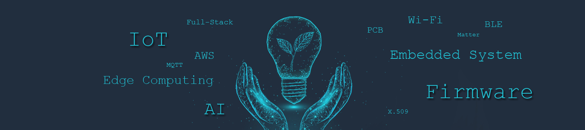

  
<table><tr><td valign="top" width="33%">

### Full-stack & DevOps

  
  
  
   
  
  

</td><td valign="top" width="33%">

### IoT & Firmware  

  
  

 

  

</td>

<td valign="top" width="33%">

### Programming 

 

 
 
  
  
    

</td>

</tr>
</table>  

I am a passionate tech enthusiast and IoT firmware engineer with expertise in various facets of technology. My experience spans *ESP32 firmware development, wireless communication, secure cloud integration,* and *edge computing,* all enriched by a keen interest in *Internet of Things* and *Artificial Intelligence*. I thrive on exploring innovative solutions that leverage these technologies to create efficient and secure systems.  

## Skills and Expertise  

- **IoT Development with ESP32**  
  - Proficient in C programming, ESP-IDF, ESP-ADF  
  - Skilled in WiFi, BLE, and FreeRTOS for robust IoT applications  

- **Embedded Systems**  
  - Experienced with STM32 development using Keil, CubeMX, and CubeIDE  

- **FPGA and Digital Signal Processing**  
  - Familiar with FPGA development using Vivado/Vitis  
  - Capable in Verilog and VHDL for hardware design  

- **Cloud Integration**  
  - Developed IoT solutions using AWS IoT and MQTT, focusing on security best practices  

- **Edge Computing and AI**  
  - Expertise in Edge AI with ONNX, Jetson CUDA/C++, and TensorFlow Lite

<!-- 
<h3 align="right">Connect with me:</h3>

 -->
